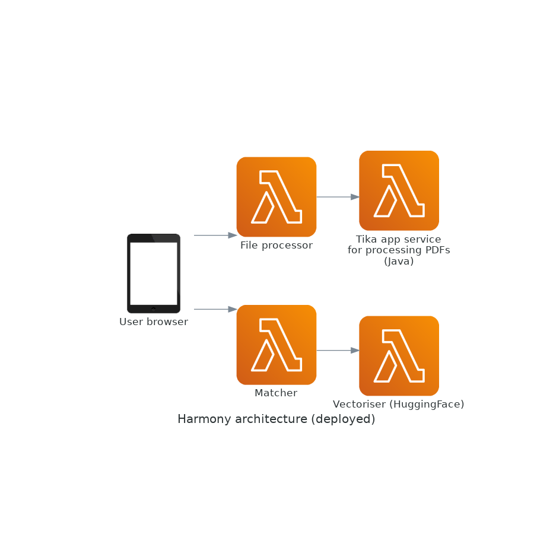

# Harmony API version 2.0

<!-- badges: start -->

<!-- badges: end -->

Harmony is a data harmonisation project that uses Natural Language Processing to help researchers make better use of existing data from different studies by supporting them with the harmonisation of various measures and items used in different studies. Harmony is a collaboration project between the University of Ulster, University College London, the Universidade Federal de Santa Maria in Brazil, and Fast Data Science Ltd.

You can read more at https://harmonydata.org.

There is a live demo at: https://app.harmonydata.org/


# Getting started

## Python bindings

You can install Harmony using:

```
pip install harmonydata
```

To process a file, do

TODO


To match, do


TODO: copy all relevant info from other repos (API and Harmony original)


## Fast API and Docker

There is a Docker API in `/harmony_fastapi`.

Please see README [here](harmony_fastapi/README.md).


## Deployment on AWS Lambda

For economy, the deployment has been divided into four AWS Lambda functions.



# How to contribute

You can raise an issue in the issue tracker, and you can open a pull request.

Please contact us at  https://harmonydata.org/contact or write to thomas@fastdatascience.com

# License

License: MIT License

# Contact

thomas@fastdatascience.com


## Built With

- [Docker](https://docs.docker.com/) - Used for deployment to the web
- [Apache Tika](https://tika.apache.org/) - Used for parsing PDFs to text
- [HuggingFace](https://huggingface.co/) - Used for machine learning
- [sentence-transformers/paraphrase-multilingual-MiniLM-L12-v2](https://huggingface.co/sentence-transformers/paraphrase-multilingual-MiniLM-L12-v2) - SentenceBERT model

## Licences of Third Party Software

- Apache Tika: [Apache 2.0 License](https://tika.apache.org/license.html)
