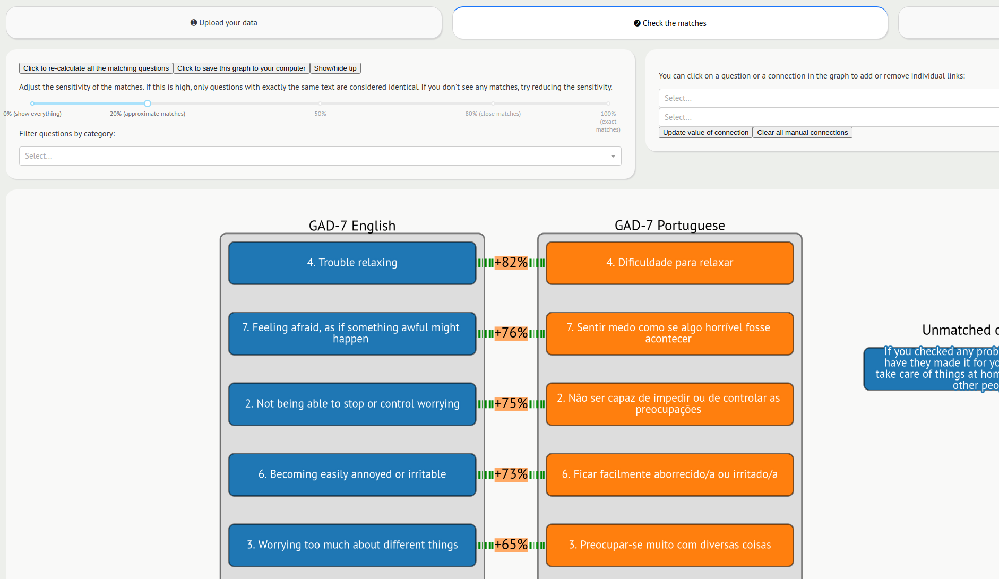
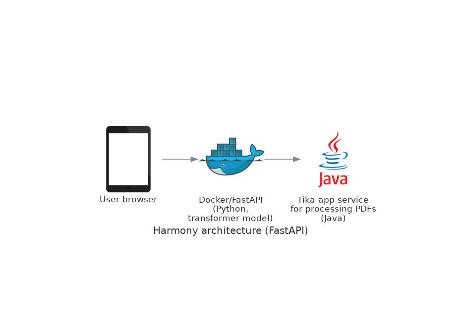
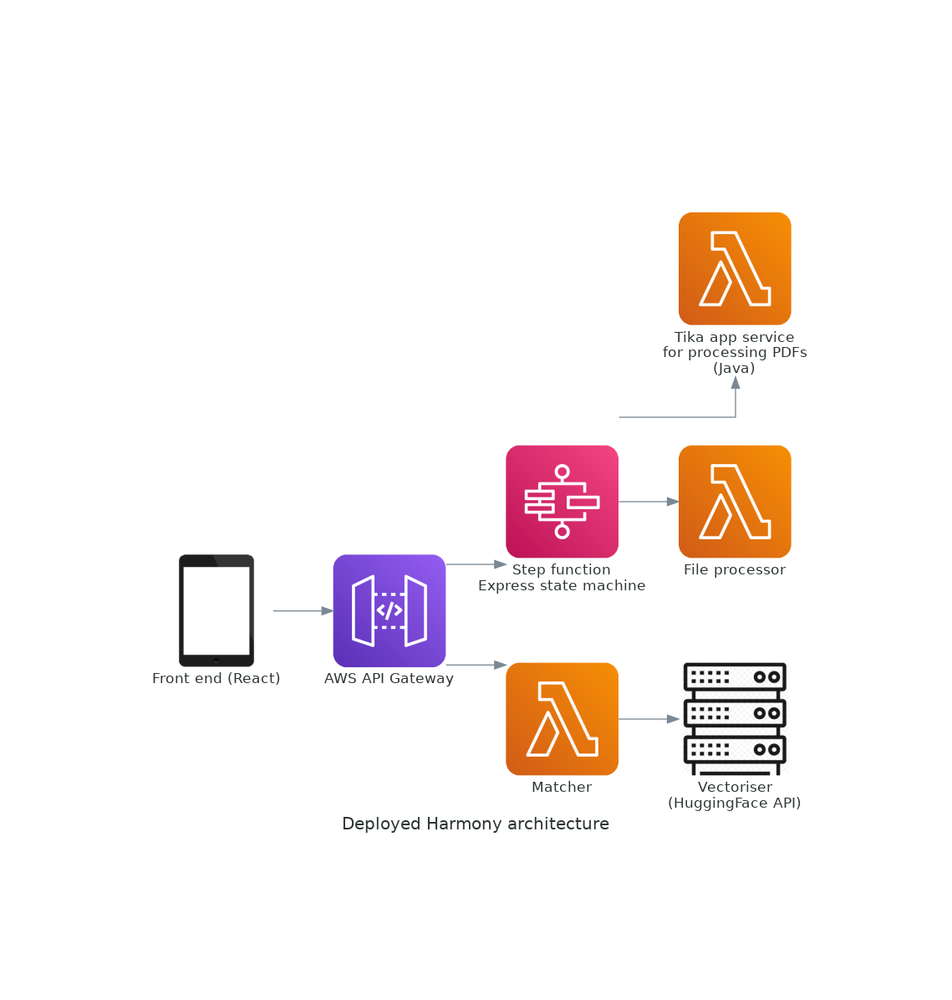

# Harmony API and Python library

<!-- badges: start -->


[](https://pypi.org/project/harmonydata/) [](https://github.com/harmonydata/harmony/releases) [](https://github.com/harmonydata/harmony/blob/main/LICENSE)

<!-- badges: end -->

## Who to contact?

You can contact Harmony team at https://harmonydata.org/, or Thomas Wood at http://fastdatascience.com/.

# How to contribute

You can raise an issue in the [issue tracker](https://github.com/harmonydata/harmony/issues), and you can open a [pull request](https://github.com/harmonydata/harmony/pulls).

Please contact us at  https://harmonydata.org/contact or write to thomas@fastdatascience.com if you would like to be involved in the project.

## Looking for the original (Plotly Dash-based) Harmony?

Please visit https://github.com/harmonydata/harmony_original

## About Harmony

Harmony is a data harmonisation project that uses Natural Language Processing to help researchers make better use of existing data from different studies by supporting them with the harmonisation of various measures and items used in different studies. Harmony is a collaboration project between the [University of Ulster](https://www.ulster.ac.uk/), [University College London](https://ucl.ac.uk/), the [Universidade Federal de Santa Maria](https://www.ufsm.br/) in Brazil, and [Fast Data Science Ltd](https://fastdatascience.com/how-does-harmony-work/) in London.

You can read more at https://harmonydata.org.

There is a live demo at: https://app.harmonydata.org/	



# Getting started

## Installing Python library

You can install from [PyPI](https://pypi.org/project/harmonydata/0.1.0/).

```
pip install harmonydata
```

You can read the user guide at [./harmony_pypi_package/README.md](harmony_pypi_package/README.md).

## Calling the Harmony API

To process a file

```
curl -X 'POST' \
  'https://rumg2mpdfd.execute-api.eu-west-2.amazonaws.com/parse' \
  -H 'accept: application/json' \
  -H 'Content-Type: application/json' \
  -d '[
  {
    "file_id": "d39f31718513413fbfc620c6b6135d0c",
    "file_name": "GAD-7.pdf",
    "file_type": "pdf",
    "content": "data:application/pdf;base64,JVBERi0xLjQKJcOiw6MKMSAwIG9iago8PAovVGl0bGUgKCkKL0NyZWF0b3IgKP7/AHcAawBoAHQAbQBsAHQAbwBwAGQAZgAgADAALgAxADIALgA1KQovUHJvZHVjZXIgKP7/AFEAdAAgADUALgAxADIALgA4KQovQ3JlYXRpb25EYXRlIChEOjIwMjMwNDA0MTkwNzE2KzAxJzAwJykKPj4KZW5kb2JqCjIgMCBvYmoKPDwKL1R5cGUgL0NhdGFsb2cKL1BhZ2VzIDMgMCBSCj4+CmVuZG9iago0IDAgb2JqCjw8Ci9UeXBlIC9FeHRHU3RhdGUKL1NBIHRydWUKL1NNIDAuMDIKL2NhIDEuMAovQ0EgMS4wCi9BSVMgZmFsc2UKL1NNYXNrIC9Ob25lPj4KZW5kb2JqCjUgMCBvYmoKWy9QYXR0ZXJuIC9EZXZpY2VSR0JdCmVuZG9iago2IDAgb2JqCjw8Ci9UeXBlIC9QYWdlCi9QYXJlbnQgMyAwIFIKL0NvbnRlbnRzIDggMCBSCi9SZXNvdXJjZXMgMTAgMCBSCi9Bbm5vdHMgMTEgMCBSCi9NZWRpYUJveCBbMCAwIDU5NS4wMDAwMDAgODQyLjAwMDAwMF0KPj4KZW5kb2JqCjEwIDAgb2JqCjw8Ci9Db2xvclNwYWNlIDw8Ci9QQ1NwIDUgMCBSCi9DU3AgL0RldmljZVJHQgovQ1NwZyAvRGV2aWNlR3JheQo+PgovRXh0R1N0YXRlIDw8Ci9HU2EgNCAwIFIKPj4KL1BhdHRlcm4gPDwKPj4KL0ZvbnQgPDwKL0Y3IDcgMCBSCj4+Ci9YT2JqZWN0IDw8Cj4+Cj4+CmVuZG9iagoxMSAwIG9iagpbIF0KZW5kb2JqCjggMCBvYmoKPDwKL0xlbmd0aCA5IDAgUgovRmlsdGVyIC9GbGF0ZURlY29kZQo+PgpzdHJlYW0KeJzFVk1LAzEQvedXzFkwzSTZfIAItbaCoFC64EE8SP1CrFg9+PfNJtm62zq1bq12odnkbd68mX2ZtncyuYb7N+gNJi8wzeNgwgS3hUgfqK795oJf3INTkss4gemMzWHOxmwcvqtxHli8abIsz8OWOnBaeJs+s16SxNLKZHDOEN7D3SlIOAvjI1xeCYCbHKl6aMasMVy4wGvC9Kk5ReELbtFKHdbF8rR6+IFd7MFzlGuNU65AI7Pc9nxbufPFdoxXc/tG0avBewuopYHXW3YXSGlFWyZ0VLLeKMQyUN4FsdEFaShnzMG+VFDewEEoMh5C+chQcLTogjWqRxIiI1JwYR1WNvlEFInoxIZceGVbSBERz7Vx0YCbICbHwRU2SyKuzkd6087HLxClVQuh86HZaNX9iFhutDBttqO8R6gYpoEMMmLSeWwgx6SCYUQcl5nuExn9/M2hyAqKFW1kDRDrfLBYypR+P/+e6RoF9JvrwkZ7h2YjXYWSdC/t68Q2LHM/32E/0bLWqX6zn2DuJ3qDemPK1nAtY+CN+M03tfvqfP9R76FP5BrVdMek86EV0BWlXU97mzzFXeKg7dDNf/Xko8v5+GK5K3XoCWtqQGuj49A+oPPJHlV8xSFd6kYi2Cd/BbufrNjj6n+vO/7nCmP2AQ9KahMKZW5kc3RyZWFtCmVuZG9iago5IDAgb2JqCjUwMAplbmRvYmoKMTIgMCBvYmoKPDwgL1R5cGUgL0ZvbnREZXNjcmlwdG9yCi9Gb250TmFtZSAvUU1BQUFBK0RlamFWdVNlcmlmCi9GbGFncyA0IAovRm9udEJCb3ggWy03NjkuNTMxMjUwIC0zNDYuNjc5Njg3IDIxMDUuNDY4NzUgMTEwOS4zNzUwMCBdCi9JdGFsaWNBbmdsZSAwIAovQXNjZW50IDkyOC4yMjI2NTYgCi9EZXNjZW50IC0yMzUuODM5ODQzIAovQ2FwSGVpZ2h0IDkyOC4yMjI2NTYgCi9TdGVtViA0My45NDUzMTI1IAovRm9udEZpbGUyIDEzIDAgUgovQ0lEU2V0IDE2IDAgUgo+PgplbmRvYmoKMTMgMCBvYmoKPDwKL0xlbmd0aDEgMTE1NTYgCi9MZW5ndGggMTcgMCBSCi9GaWx0ZXIgL0ZsYXRlRGVjb2RlCj4+CnN0cmVhbQp4nMVaDXAb1Z1/T5Ll4ASImzgGQshavlgJKLKJsRUcSCNLsi1blhxJdgiFOGvtylp9rbK7smOSEDiGS8FJUwoEkvRK28mlcz2Gr+t0UgoZPpr2OK6dUsrljo9j2sCRMBylN9xNSWLl/u/tW33FhAy9m5Mi7dv3/h+//+d7WgdhhNAcdBcyIxSKtK7KPP7JH2FmN3xGxtNT8X+T3vsUxu8hdMmvEyIviK/6exGq+xHMdSZgYo517t/C/Udw/xeJjLZ1KjXnNYTmzof7dFqO8UsuX/o83G+H+9UZfmsOXYO64J7wc1k+I27/pu2f4P63CDUFEbZchb+JahCqaa/ZjxC+Rr+aj6O46SsImaxWc421xmSyvI+s58LoszN1FsSBJDQU9wloHeLOnbMuLCzEB2oz+MRmhB579zhZRSYUL+yzxGsOgZW1CC2ob6pf1lTfFLegs6p58dn3C/tqL/vTfyrWFQij06Dv05pPUB0g6miqr+lY1l7f1ICbsaXwOk7fjy1Jy5sv3/PR6TuSABC9eO4EfhV9jC5HyHWDq7N9VeOihoW11mabveXFlmVdLju8XF3LWhKu5Xb7ctfqFrt9GeHbAja6at5ADQi1d7TXN4Mm8mli4/aGLUePWn6+bWYtLmzbVjD9IVmDUoUfvVaY99PC/J/O3JkkNonnfm8ZsXjRVagZRDY1LGxc1L7I1elqt9Za7VZ7i6tFB1TbYm9phrlay8jZD9av/85UMMA95JiYfPHUnr0Y777/xB/vvvu31r7+XXf19V9uQnOOZ7LY/dUdT23YiPHB/YUzBw889PDTz45uwps2HyHY14DysHUhugShZe0NDDI+9MTMqaefxlIymaxZR/H1w9fmmhPgmyvB5y2V3llQ5PwFbm5qXdnc1GRztjY1f/TEzIdPPYUTNVtWNttszStbm+B1ZnkyaQ6nQDfItHwMNjcV/dbQCYIXNS5qrNcl3gDG2mqt5DZ6GAStiqxPPxkN40MFy2NtbVN3ebz4u0TY86nVLiyI/zzz82TShF7q77t99JnCVUni18JqywnQYUerwdx6Ahi8ae8gWtpXuTo7Oqy6DR1gk4uoBhQY9NqJXisjsrTfufOktHnzLZvrvZ4d3xsccIWj245t24F3bD+2LRp24UThUf/A9N7efoz7e/dOD/jNz5392r8DwcIFLe8m2tpuu/XYXtHZ9u0DZ04fPICxs004nCrsPhoXcG7L2+/ktojCC0j3iPl1QHs1wdrcUrK+qeQfFzje/Hqyxm4fuA/0vTHzS+KZjpHhO1auarOsKPx3yG7fNPokmJ80R6Xn5c4bcO0chM9BLVh2WuzoMqgFTGQ1Y+NyujA1hU/9EF+Hr3sM750sTJmfS6VmlpneSqXOemnFQXYmAdflaCnkCfEI8ZBV91AjOLSD1UsjzJkSDw4ODAw++HD/IMaDgQdP7d6zZ/rDk9+Yxnj6Gz35/Hvv5VWMVXLNx0hSzhzYv//ATGH/QfCA69wJy1uAcgmpAmq4ER9aS6ws4Mb0Br7licKB9vXh5DPh6GE82ubcttPr+a7FftaTfC7VuVoUjptuTM08/FJfHx7d9Pf4BEhXz/3e/AzY0QEVXkwBF/jZDv+oEcS7jQ3NrMpIGTbCPz3TwU41aentuX+7ex2J4f5777t5bSp5NHr77bFkjcebz3fdtHLlrm/t83ar+X9M8LE1f9ratabVudHnuHbVyus83fEHIHcXNa44GV/ThZevCHvtK65d2drTKz86vAE3LqIZUDiFj6ETpGM1kmB3kAZQ27/JcR0+Nqev/4FfeEdv+6tlj09tu9WIyzTYcylaBcwdBHLjQt2qBUXnGeFpIkGjvaO5w8ij1v+4D2rI68mrvT1HDhUOrQ2tTz4znpiceBOb/P33yuvc80dHb7t15G0IWfB3uOumqdw6d28Pfn7mN0l1wNaMR2//3qHbvubf6u3G17fzx5cvWoAzMtgBXQIyxo4WA64FLM1oGpvN9MJyzxR9dy/ev6dwAgemCw27Pjh5fyG9By8rPH8Pfmun6T7cnkoVJguuZBKvLbwE3w/ho6mU3i9PWE5A37oCrWCdq7qOSb6YO6oq2dL+VOHRquJ9AsePVBZvMnm4slhNK5JnXpXKy5XEahpsDMLuAv0LN9ez1tWwEFtrManXpg7cqVcKcTq25pLZdOLk13cVfnXFvMIuk5w/ezM+9rB7XXDovr3BkGULrrvxmmtwTnnx7cKvG4HiSOFQBv9s353bp/eNDOOeXtAonDthPQw7zYJix8S0LTTXN2OIt/DKK3ineec/mOa9MnXW+wrZZ87ELa2p1Okpy4dn/jpJ+j1UgL1mC4kLhKW9nuyHxbLSdxvixHe+//2f4FsLh6+6srevqck0fUlP7wOPdXdDX8D9hR+nZm7/+rIW7Lh29FvdXtzr+yGJyBqIyBEjIi5arZ16KIxtwg5Rwiw9Dbc0fATbTGc0vP3lHdu373h5ezjaWXgES/3+3bv7+/r6d+/295MtaCYjtDkxPnDw9JkD325zioeTOP+CIG7JvfP2lhwW4kcpgsKI5QhUw3x0HUSkoUqT3eif5Yj01ooPles7ch4ishua+qRyhT9OHa5EVFicInsaqcglgMEGCMqKj2Wk0dFZNrosS+xy7knSIHefEkRBTDX09P3lwwHSNwf2TfT1LMZf/btbNpIeeW7/IxgvuqKt8Mm0e52af/8DVVt7850kCyH7rEeh0hbCjVFqpLXrBbYAm4/j+Z8cwHdPFH62v3C68NmDhWOT+HePf4y/Aq3yJdPrpMeTcxPt+SvNaxHZK2DXJHsFR042lZsFyxC2g0LS4Gd7CmrF9nHlqpvXZluvb79+k3XJ1Td1NnMvP23+lbGhnInucLTiObXzX/VdfQ3mrkHkzAqfd0eafzB6+U3/RQ6w1S+Cx3oUcgsja3ESeGozBdgn6tFn/3I2Zz1KJZW/Flt+ieI1jei0aRq9CB9UswdtsTwH58+9aA18+mvs8FmK4ubXUb/l3nOnLa8BvR25LIuRCvT9lmMobrkHXUloQM40HDcFswutgXv6sWxDceu/oibCC/oakAP1wTuJDqNn0Xt4Ec7gg/gn+GPTElPWdK/pN2aT2WveYf6O+VXLPEvQssvytOUkRb0Y3Qj5y6w673UVXlucH0UvsDFG83AXG5uQBa9nYzPM59jYAuNH2LgGxoaPrGgu3Q8R/b1Qb1rAxnPREhPPxpde8mDDD9j4MnTD0r9h4/lo3tJP2bgeWbi5oBFb4PyIjlLtZIzRFZhjYziE4l42NsP8CBtbYLyDjWtgfIiNrWgRnML18Rxkw39g47moy7SMjS9d0GLaycaXocTSNWw8H12x9E02rkdzOIw8SEY5NIUUJKFxlEAa5PRyFIMexcGe2QbvdhiNAQWHuoFGQyp8FCQiHmUgnhzyoyzQO2HkRml4cyhclKXSOxGuIvBMwLcAlHXIC6MkSBhBeaCIAS0PUsYpJQdjIp8DKVn4zgHNGMiVgI4Dfhn08nQNzgAeOTelSOMJjVseW8Gtamtr58amuG5JUzVF5DMOzp+NOTl3Os2FCZXKhUVVVCZEwVnnFZP8SJ6LJfjsuKhyvCJyUpbL5cfSUowT5AwvZUFBJdIItUNCcVjQ2SOiIsFdN8CSEey83bKcumiuiyQboQsqLMnUI6vAh+3IBQuiokpyllvlbHdVSjtP1qwa41SgHiaNhdTQHZez4C4NnIhoKDUIRBdqhbfAZEyADCfwynBVIDgilafQMDpBrgg8KKFpua7WVgGETuSdqpxXYmJcVsZFZ1aE5Z4yBEbYjfQ7P93IGkklkaakCEkho0mgJcn3v5NSJDnrZtWsB4GHUTnm88unDq38M95E+/9HSc7u7ZLNEvMiR9d5mgMZ6tUUzMkQ+S/CQiwbovIyVFopnXXZCbomMrvGqZYszUqByonTVbGoTY+wnm0OikumCLOUP8dKRtcgg1SNRViiWaHbEmOeNmRqFEVlXfBAFaMZkmPSDQmEWseuZ5II8yrLYFtZltho5AivQK8qxRUDHp7Zp+dgDLIyQ6VodMXwTxxGaZbHy4sYSxpI5yD4NagFPc+JxpJPyEwOvmXQkqc4S2gEaoFGc20MVjW6auj4fA0OVksxQJanUnSfTNIcSNCeoDHPZOhcuUWGfKUiK3W0eepDR1l0yDhD42nEulS/KnA7PscOR9HOVtqXOCpZrwddtsS8Whn9C1tteE5HmytmtFaVdSWLJqk/MhelwaiGOO2pWWahWKZRoN9Eh4NeiSeSQBGj8nSa8jxOsy5pRChGdQsUscSQdtHqjDIuHiTKtDOUYlDei0oeOL8TZIFeY9WgVtAatVLyWHkPKOfjqM08i9RYsW8buaZ7Q+/k/AXiKdM9iGOxz9BrqX9cTCw0sDxH9zWeWeSs8NSFeIlPpor4M7T6JFrLRkcj2DXW9fQZHSnxqVAW8/KsM/YvokX3Vx6k8JTPsEigSEm8smXeGAc6Yk2CzSllPZSn2aPnrqGj2j/qF9pU3uOEigzjaYxmQ3BhJJX6qv0yG0YHi3ua8kkX6OoK60AixZepkGvMqMXMNOqmehcRWb8TKyIwSa0SKL9tln3RVrS7moPQG7uurSzb9NoJVO0zY7Tu5TKseVYPRiQmYFWaxWMi2kr9nGUVnYO3vovxtLOKRY7y+OuYL1wxCdrpOXpVGUaRZtTn54tu3Ww9nKzmKVWlh2fzKlfmufIYftmaVWn3NPbsUtUZFUVOEOniGURhHJUSczSjU/A9ziKm74tZ6tvq88f/Rcf6fKvGWI1obF+MFz3Vh3xUTwgF4Y7oCcFdFG2A82SYrvlhjoPzXBhWRuDOC7NeGhc3XSHrNlqNG2BMJIbQMJWlywjDN5G9EWaIbI7ek7sBoA+CLMLrQ7dQHT6QFqGUYSp7EGYDcPUxOsLhgZlhuCfjXkROo7q+IHBFae0QPoJFRxqF+ZLWSlR+qtFANgh3YZDfx1bdINtP5RH8DuopMg4WcfYwpG7qIyKZyPQAogC9I7PDcB0Cugj1p5varKMNUht6YF23xUcR6JHQEXngOgS6CUUv4IpSFERTlFE6qIXEHi/lJ1oH6KyOLMSiTMYlKU7mSx0H8f9IUXOE2h+AN0ftj8JMlMbGDfINuUbu9FIJg8U8Gqb2uakfQlRDN10jXiT+DBQpw2VR8VB/kbgR5F6qyU09EpnVEkNaZXRmyw5DQy+1z0c9FaDUEfCjD+j9xRk9H/3UVg/zrS5Tz3s9JwJl3vVQG0lk14NWH8spN/VdpRV6hRD8JSv0CLjZt6fMZ6XoB1l0PcVYh2iWne+VDbQWfZTKTWMdKXqhh9bvIEM+XJZhRhyHWX6Gisgq/WvUkUF3Mb1Dl2Xoroygl+ZTgCGMFL3xxXL13uWDfS1Gf+9oxb5duXOXnx5Lp9Ly86ejrNeWnwT0LtxLaTNVdKVZvT/re1bpN0/5GW62ncv4layf6UunX+P0ofdu/bdR+elXoOd0/SyoFk8l+v4hF08mk3S1tKfrvwYzlKL8955K9eqW5RlHtSz9fMnT0wLRps7izQvtUNW/EHN0v9e1TNKxxk4mxL48oyXzd1T9KlaqflV9UQwMW77I/wqNd479ppKoh8l50snkKsj4fVbyCfGA/vQrUxX1UvYRaV2o+hxKfDBehlxgEdefpBGddQj10Idx5BElecxZfLzJLVdFkRsT0/LkCid3EQ80nXV1JeYRUeE5XXLxMWrdygu+6uq+/ANXrkqzBBA5TeEFMcMrKU6OV0upqxsSlYyk0kecQJ0QFRF0jSt8VhMFBxdXwHhgA4OVcdHBaTLHZ6e4nKiowCCPaWCwlB0HLTEATSi1hMiea/KxmJzJATkh0BIgHZwkZlVwsI26xLYChAkcr6pyTOJBH3gwls+IWY3XCJ64lAYfLycSKQMXkePaJPjctoIiUcScIgv5mEjFCBIYJo3lNZFiqGBwQJRi6bxAkExKWkLOawAmIzFFhF7RXQli8yrQE3McXEakVtP4qglHmQ4H0dkqK5wqQhyAWgKozPwq1QQciM0RR2vMdVTRZELOnM9AwhDPK1lQKFJGQeZU2cGp+bGkGNPIjO7jNKQkMSgmZwWJ2KF21dVFYYkfkydEaoGeRRRAMQmysgZhUPVZEpVcKQP0NU5N8GDUmMi8BjAgyfkKO+Us5IXCZWRFnNVsTpvKiXEeFDl1UJWrGX6KyM/IghSXSKLxaQ1SDwYglBcEarnuOlJfvAK48mleoYoEUZXGsxTGeHoql1AJE8lQPgZCVMJh4FGrNekZJ+gO49NlAqqEMD4DS0kiQMympzipItXBJEUk//2M0pKBSpxJYmOUiAh5J+oGTMqKoHK2Yi3aiG5jgbOR0rVRt0F0AqxmxkSoJiI1D3EgRkzIUhGYuFWDquH4XA5KjB9Li2RBtx8kVwUmwWtcgldBopit9AuoK2W4wOWzAgNsq+wrNt3CC0VWldOksmnoSKB4Lk06CNSLQZjjYyl+HAyDWszKxf5x8YlVoQqaFkAU03ECqs/H9YSCUS4S6olucId9nD/CDYVDI36vz8vZ3BG4tzm4Df5oX2g4ygFF2B2MbuRCPZw7uJEb8Ae9Ds53y1DYF4lwoTDnHxwK+H0w5w96AsNef7CX6wa+YCjKBfyD/igIjYYoKxPl90WIsEFf2NMHt+5uf8Af3ejgevzRIJHZA0Ld3JA7HPV7hgPuMDc0HB4KRXwgwwtig/5gTxi0+AZ9YAQI8oSGNob9vX1RBzBFYdLBRcNur2/QHR5wEIQhMDnMURInoAQZnG+EMEf63IEA1+2PRqJhn3uQ0BLv9AZDg8RHw0GvO+oPBbluH5ji7g74dGxgiifg9g86OK970N3ri5SUEDJmTskdhKHXF/SF3QEHFxnyefxkAH70h32eKKUE34MnAhSuJxSM+NYPwwTQGSogIH0+qgIMcMM/D0VGzQ+CuURONBSOFqFs8Ed8Ds4d9kcIhJ5wCOCSeAIHsXEY/EmCF2R4SYzI3PnZAVSEmxno9bkDIDBCYJxHC9nl2xoTcxrJbVbcenukrVTvnw6atXoTgBTuzULh6nN0CPkMlUV3Hr3DlYqLbMkO1n5J+4Dsht1Ib7/ChAhdUCWtBOpDJs1kUlJppcM2mJHZvqfyaVAGXEUq6Jd8GtjUIszKgjI2xJwiAcukImnQTDg+D7OKdAfbihW2VVVbQLRU41dENQc7lTQhpqecQKuQ/YwikbJxWckw06n7YlqX0UM1bpwKF8BwWRl3cnV/zl9FW+kpOAWfVnpyFOjzOCd9NpqDucrnfBf+G2rrpJSSWiVoh1uduUSulfXkL/uXa/Q/m89mOgplbmRzdHJlYW0KZW5kb2JqCjE3IDAgb2JqCjU0ODMKZW5kb2JqCjE0IDAgb2JqCjw8IC9UeXBlIC9Gb250Ci9TdWJ0eXBlIC9DSURGb250VHlwZTIKL0Jhc2VGb250IC9EZWphVnVTZXJpZgovQ0lEU3lzdGVtSW5mbyA8PCAvUmVnaXN0cnkgKEFkb2JlKSAvT3JkZXJpbmcgKElkZW50aXR5KSAvU3VwcGxlbWVudCAwID4+Ci9Gb250RGVzY3JpcHRvciAxMiAwIFIKL0NJRFRvR0lETWFwIC9JZGVudGl0eQovVyBbMCBbNjAwIDYzNiAzMTggMzE4IDY5NCA1OTIgMzIwIDMyMCA2NDQgNjQwIDQ3OCA1NjUgNjAyIDY0NCA1MTMgMzE4IDU5NiA1NjQgNjQwIDYzNiA4NzUgNDAyIDY0MCA2NDAgNTYwIDg1NiA1NjUgXQpdCj4+CmVuZG9iagoxNSAwIG9iago8PCAvTGVuZ3RoIDU0NiA+PgpzdHJlYW0KL0NJREluaXQgL1Byb2NTZXQgZmluZHJlc291cmNlIGJlZ2luCjEyIGRpY3QgYmVnaW4KYmVnaW5jbWFwCi9DSURTeXN0ZW1JbmZvIDw8IC9SZWdpc3RyeSAoQWRvYmUpIC9PcmRlcmluZyAoVUNTKSAvU3VwcGxlbWVudCAwID4+IGRlZgovQ01hcE5hbWUgL0Fkb2JlLUlkZW50aXR5LVVDUyBkZWYKL0NNYXBUeXBlIDIgZGVmCjEgYmVnaW5jb2Rlc3BhY2VyYW5nZQo8MDAwMD4gPEZGRkY+CmVuZGNvZGVzcGFjZXJhbmdlCjIgYmVnaW5iZnJhbmdlCjwwMDAwPiA8MDAwMD4gPDAwMDA+CjwwMDAxPiA8MDAxQT4gWzwwMDMxPiA8MDAyRT4gPDAwMDk+IDwwMDQ2PiA8MDA2NT4gPDAwNkM+IDwwMDY5PiA8MDA2RT4gPDAwNjc+IDwwMDcyPiA8MDA3Nj4gPDAwNkY+IDwwMDc1PiA8MDA3Mz4gPDAwMkM+IDwwMDYxPiA8MDA3OD4gPDAwNjQ+IDwwMDMyPiA8MDA0RT4gPDAwNzQ+IDwwMDYyPiA8MDA3MD4gPDAwNjM+IDwwMDc3PiA8MDA3OT4gXQplbmRiZnJhbmdlCmVuZGNtYXAKQ01hcE5hbWUgY3VycmVudGRpY3QgL0NNYXAgZGVmaW5lcmVzb3VyY2UgcG9wCmVuZAplbmQKCmVuZHN0cmVhbQplbmRvYmoKNyAwIG9iago8PCAvVHlwZSAvRm9udAovU3VidHlwZSAvVHlwZTAKL0Jhc2VGb250IC9EZWphVnVTZXJpZgovRW5jb2RpbmcgL0lkZW50aXR5LUgKL0Rlc2NlbmRhbnRGb250cyBbMTQgMCBSXQovVG9Vbmljb2RlIDE1IDAgUj4+CmVuZG9iagoxNiAwIG9iago8PAovTGVuZ3RoIDQKPj4Kc3RyZWFtCv///+AKZW5kc3RyZWFtCmVuZG9iagozIDAgb2JqCjw8Ci9UeXBlIC9QYWdlcwovS2lkcyAKWwo2IDAgUgpdCi9Db3VudCAxCi9Qcm9jU2V0IFsvUERGIC9UZXh0IC9JbWFnZUIgL0ltYWdlQ10KPj4KZW5kb2JqCnhyZWYKMCAxOAowMDAwMDAwMDAwIDY1NTM1IGYgCjAwMDAwMDAwMTUgMDAwMDAgbiAKMDAwMDAwMDE2OSAwMDAwMCBuIAowMDAwMDA4MjQzIDAwMDAwIG4gCjAwMDAwMDAyMTggMDAwMDAgbiAKMDAwMDAwMDMxMyAwMDAwMCBuIAowMDAwMDAwMzUwIDAwMDAwIG4gCjAwMDAwMDgwNTIgMDAwMDAgbiAKMDAwMDAwMDY3MCAwMDAwMCBuIAowMDAwMDAxMjQ0IDAwMDAwIG4gCjAwMDAwMDA0ODQgMDAwMDAgbiAKMDAwMDAwMDY1MCAwMDAwMCBuIAowMDAwMDAxMjYzIDAwMDAwIG4gCjAwMDAwMDE1MzkgMDAwMDAgbiAKMDAwMDAwNzEzNSAwMDAwMCBuIAowMDAwMDA3NDU0IDAwMDAwIG4gCjAwMDAwMDgxODkgMDAwMDAgbiAKMDAwMDAwNzExNCAwMDAwMCBuIAp0cmFpbGVyCjw8Ci9TaXplIDE4IAovSW5mbyAxIDAgUgovUm9vdCAyIDAgUgo+PgpzdGFydHhyZWYKODM0MSAKJSVFT0YK"
  }
]'


curl -X 'POST' \
  'https://rumg2mpdfd.execute-api.eu-west-2.amazonaws.com/parse' \
  -H 'accept: application/json' \
  -H 'Content-Type: application/json' \
  -d '[
  {
    "file_id": "1d66bce4b80c4b0eaefe33f00cddedef",
    "file_name": "GAD-7.xlsx",
    "file_type": "xlsx",
    "content": "data:application/vnd.openxmlformats-officedocument.spreadsheetml.sheet;base64,UEsDBBQAAAAIAGmwhFZGWsEMggAAALEAAAAQAAAAZG9jUHJvcHMvYXBwLnhtbE2OTQvCMBBE/0rp3W5V8CAxINSj4Ml7SDc2kGRDdoX8fFPBj9s83jCMuhXKWMQjdzWGxKd+EclHALYLRsND06kZRyUaaVgeQM55ixPZZ8QksBvHA2AVTDPOm/wd7LU65xy8NeIp6au3hZicdJdqMSj4l2vzjoXXvB+2b/lhBb+T+gVQSwMEFAAAAAgAabCEVu3qrybuAAAAKwIAABEAAABkb2NQcm9wcy9jb3JlLnhtbM2Sz0rEMBCHX0VybydpRSR0e1E8KQguKN5CMrsbbP6QjLT79qZ1t4voAwi5ZOaXb76BdDpKHRI+pxAxkcV8NbnBZ6njhh2IogTI+oBO5bokfGnuQnKKyjXtISr9ofYIDec34JCUUaRgBlZxJbK+M1rqhIpCOuGNXvHxMw0LzGjAAR16yiBqAayfJ8bjNHRwAcwwwuTydwHNSlyqf2KXDrBTcsp2TY3jWI/tkis7CHh7enxZ1q2sz6S8xvIqW0nHiBt2nvza3t1vH1jf8Kat+HU520ZI3kpx+z67/vC7CLtg7M7+Y+OzYN/Br3/RfwFQSwMEFAAAAAgAabCEVplcnCMQBgAAnCcAABMAAAB4bC90aGVtZS90aGVtZTEueG1s7Vpbc9o4FH7vr9B4Z/ZtC8Y2gba0E3Npdtu0mYTtTh+FEViNbHlkkYR/v0c2EMuWDe2STbqbPAQs6fvORUfn6Dh58+4uYuiGiJTyeGDZL9vWu7cv3uBXMiQRQTAZp6/wwAqlTF61WmkAwzh9yRMSw9yCiwhLeBTL1lzgWxovI9bqtNvdVoRpbKEYR2RgfV4saEDQVFFab18gtOUfM/gVy1SNZaMBE1dBJrmItPL5bMX82t4+Zc/pOh0ygW4wG1ggf85vp+ROWojhVMLEwGpnP1Zrx9HSSICCyX2UBbpJ9qPTFQgyDTs6nVjOdnz2xO2fjMradDRtGuDj8Xg4tsvSi3AcBOBRu57CnfRsv6RBCbSjadBk2PbarpGmqo1TT9P3fd/rm2icCo1bT9Nrd93TjonGrdB4Db7xT4fDronGq9B062kmJ/2ua6TpFmhCRuPrehIVteVA0yAAWHB21szSA5ZeKfp1lBrZHbvdQVzwWO45iRH+xsUE1mnSGZY0RnKdkAUOADfE0UxQfK9BtorgwpLSXJDWzym1UBoImsiB9UeCIcXcr/31l7vJpDN6nX06zmuUf2mrAaftu5vPk/xz6OSfp5PXTULOcLwsCfH7I1thhyduOxNyOhxnQnzP9vaRpSUyz+/5CutOPGcfVpawXc/P5J6MciO73fZYffZPR24j16nAsyLXlEYkRZ/ILbrkETi1SQ0yEz8InYaYalAcAqQJMZahhvi0xqwR4BN9t74IyN+NiPerb5o9V6FYSdqE+BBGGuKcc+Zz0Wz7B6VG0fZVvNyjl1gVAZcY3zSqNSzF1niVwPGtnDwdExLNlAsGQYaXJCYSqTl+TUgT/iul2v6c00DwlC8k+kqRj2mzI6d0Js3oMxrBRq8bdYdo0jx6/gX5nDUKHJEbHQJnG7NGIYRpu/AerySOmq3CEStCPmIZNhpytRaBtnGphGBaEsbReE7StBH8Waw1kz5gyOzNkXXO1pEOEZJeN0I+Ys6LkBG/HoY4SprtonFYBP2eXsNJweiCy2b9uH6G1TNsLI73R9QXSuQPJqc/6TI0B6OaWQm9hFZqn6qHND6oHjIKBfG5Hj7lengKN5bGvFCugnsB/9HaN8Kr+ILAOX8ufc+l77n0PaHStzcjfWfB04tb3kZuW8T7rjHa1zQuKGNXcs3Ix1SvkynYOZ/A7P1oPp7x7frZJISvmlktIxaQS4GzQSS4/IvK8CrECehkWyUJy1TTZTeKEp5CG27pU/VKldflr7kouDxb5OmvoXQ+LM/5PF/ntM0LM0O3ckvqtpS+tSY4SvSxzHBOHssMO2c8kh22d6AdNfv2XXbkI6UwU5dDuBpCvgNtup3cOjiemJG5CtNSkG/D+enFeBriOdkEuX2YV23n2NHR++fBUbCj7zyWHceI8qIh7qGGmM/DQ4d5e1+YZ5XGUDQUbWysJCxGt2C41/EsFOBkYC2gB4OvUQLyUlVgMVvGAyuQonxMjEXocOeXXF/j0ZLj26ZltW6vKXcZbSJSOcJpmBNnq8reZbHBVR3PVVvysL5qPbQVTs/+Wa3InwwRThYLEkhjlBemSqLzGVO+5ytJxFU4v0UzthKXGLzj5sdxTlO4Ena2DwIyubs5qXplMWem8t8tDAksW4hZEuJNXe3V55ucrnoidvqXd8Fg8v1wyUcP5TvnX/RdQ65+9t3j+m6TO0hMnHnFEQF0RQIjlRwGFhcy5FDukpAGEwHNlMlE8AKCZKYcgJj6C73yDLkpFc6tPjl/RSyDhk5e0iUSFIqwDAUhF3Lj7++TaneM1/osgW2EVDJk1RfKQ4nBPTNyQ9hUJfOu2iYLhdviVM27Gr4mYEvDem6dLSf/217UPbQXPUbzo5ngHrOHc5t6uMJFrP9Y1h75Mt85cNs63gNe5hMsQ6R+wX2KioARq2K+uq9P+SWcO7R78YEgm/zW26T23eAMfNSrWqVkKxE/Swd8H5IGY4xb9DRfjxRiraaxrcbaMQx5gFjzDKFmON+HRZoaM9WLrDmNCm9B1UDlP9vUDWj2DTQckQVeMZm2NqPkTgo83P7vDbDCxI7h7Yu/AVBLAwQUAAAACABpsIRWZJCgEIMBAADfAgAAGAAAAHhsL3dvcmtzaGVldHMvc2hlZXQxLnhtbH1STU/cMBD9K5bPFV52Ba1QEolSIXpotQW1PTvJJLFwPOl4wsK/70xgoz2UHizPl9+beePigPSYBwA2z2NMubQD83TlXG4GGH0+wwmSZDqk0bO41Ls8Efh2eTRGt91sLt3oQ7JVscT2VBU4cwwJ9mTyPI6eXj5DxENpz+0xcB/6gTXgqmLyPTwA/5z2JJ5bUdowQsoBkyHoSnt9fnW90/ql4FeAQz6xjU5SIz6q87Ut7UYbgggNK4KX6wluIEYFkjb+vGHalVIfntpH9Ntldpml9hluMP4OLQ+l/WRNC52fI9/j4Q7e5rlYG/zi2VcF4cGQzlkVjRoL9yKEVIekKj0wSTYIHVc/Zsjab+FYWtGYa+QIygq1XaG274DcAkioNwnoCef8wfj0HBYDyYgW0PbwH4LdSrB7h+A7sqlBKXwdwTCazDgpeoOJCaMug16k4F807kQeXf03T31I2UTohG1z9vHCGnqV89UR7EWxGplxXMxBfiCQFki+Q+Sjo9tc/3T1F1BLAwQUAAAACABpsIRW4O5QR6kCAAAWCwAADQAAAHhsL3N0eWxlcy54bWzdVtuK2zAQ/RXhD6iTmJq4xIE2ECi0ZWH3oa9KLMcCWXJlOST79Z2RHOeymqXtYxM2Hs3RmTOaGeFd9e6sxHMjhGOnVum+TBrnuk9p2u8b0fL+g+mEBqQ2tuUOlvaQ9p0VvOqR1Kp0MZvlaculTtYrPbTb1vVsbwbtymSWpOtVbfTVs0iCA7byVrAjV2Wy4UrurPR7eSvVObgX6NgbZSxzkIookzl6+tcAz8MKsxzjtFIbi840KITf3bj9BvCPHjZIpe4zA8d61XHnhNVbWHiOd76B2Gi/nDtI7WD5eb74mFwJ/gEiO2MrYe9kgmu9UqJ2QLDy0ODTmS5F0DnTglFJfjCa+xwujFsm860rE9dA6S9hHp0Q89EVBB69k8RoQOZ7odQz7vpZT+nPIf1TzUKfv1bYYobVvJhw5tEMYcIC499GC7Fvwi7+KSzr5NG4LwOcR/v1r8E48WRFLU9+faonfSr6nIgOft516vxZyYNuRTj7HwuuV/zCY42x8hXUcAr34BA2YUdhndyjBxrky3OqxxpN5fHFuiv85GV4ecrkB95JdVVlu0EqJ/W4amRVCf2m/hDe8R1c+rv4sL8SNR+Ue5nAMrna30Ulh7aYdj1hJcZdV/sbzuA8n24uaEldiZOoNuPSHnbeZGCA6vjx8/uAbP0njlCcgMURxCgdKgOKE1iUzv90niV5noBRuS2jyJLkLElOYMWQjf9SOnFOAZ/4SYsiy/KcquhmE81gQ9Utz/EvHo3KDRmUDir9Xa3pbtMT8v4cUD19b0Kok9KTSJ2UrjUi8bohoyji3aZ0kEF1gZod1I/r4EzFOVmGXaVyo24wjRQFheAsxmc0z4nq5PiN94e6JVlWFHEEsXgGWUYheBtphMoAc6CQLPPvwYf3UXp5T6XX/4TXvwFQSwMEFAAAAAgAabCEVpeKuxzAAAAAEwIAAAsAAABfcmVscy8ucmVsc52SuW7DMAxAf8XQnjAH0CGIM2XxFgT5AVaiD9gSBYpFnb+v2qVxkAsZeT08EtweaUDtOKS2i6kY/RBSaVrVuAFItiWPac6RQq7ULB41h9JARNtjQ7BaLD5ALhlmt71kFqdzpFeIXNedpT3bL09Bb4CvOkxxQmlISzMO8M3SfzL38ww1ReVKI5VbGnjT5f524EnRoSJYFppFydOiHaV/Hcf2kNPpr2MitHpb6PlxaFQKjtxjJYxxYrT+NYLJD+x+AFBLAwQUAAAACABpsIRWGrobqzABAAAjAgAADwAAAHhsL3dvcmtib29rLnhtbI1R0UrDQBD8lXAfYFLRgqXpi0UtiBYrfb8km2bp3W3Y27Tar3eTECz44tPezizDzNzyTHwsiI7Jl3ch5qYRaRdpGssGvI031EJQpib2VnTlQxpbBlvFBkC8S2+zbJ56i8GslpPWltPrhQRKQQoK9sAe4Rx/+X5NThixQIfynZvh7cAkHgN6vECVm8wksaHzCzFeKIh1u5LJudzMRmIPLFj+gXe9yU9bxAERW3xYNZKbeaaCNXKU4WLQt+rxBHo8bp3QEzoBXluBZ6auxXDoZTRFehVj6GGaY4kL/k+NVNdYwprKzkOQsUcG1xsMscE2miRYD7kZLA6BdG6qMZyoq6uqeIFK8KYa/U2mKqgxQPWmOlFxLajcctKPQef27n72oEV0zj0q9h5eyVZTxul/Vj9QSwMEFAAAAAgAabCEViQem6KtAAAA+AEAABoAAAB4bC9fcmVscy93b3JrYm9vay54bWwucmVsc7WRPQ6DMAyFrxLlADVQqUMFTF1YKy4QBfMjEhLFrgq3L4UBkDp0YbKeLX/vyU6faBR3bqC28yRGawbKZMvs7wCkW7SKLs7jME9qF6ziWYYGvNK9ahCSKLpB2DNknu6Zopw8/kN0dd1pfDj9sjjwDzC8XeipRWQpShUa5EzCaLY2wVLiy0yWoqgyGYoqlnBaIOLJIG1pVn2wT06053kXN/dFrs3jCa7fDHB4dP4BUEsDBBQAAAAIAGmwhFZlkHmSGQEAAM8DAAATAAAAW0NvbnRlbnRfVHlwZXNdLnhtbK2TTU7DMBCFrxJlWyUuLFigphtgC11wAWNPGqv+k2da0tszTtpKoBIVhU2seN68z56XrN6PEbDonfXYlB1RfBQCVQdOYh0ieK60ITlJ/Jq2Ikq1k1sQ98vlg1DBE3iqKHuU69UztHJvqXjpeRtN8E2ZwGJZPI3CzGpKGaM1ShLXxcHrH5TqRKi5c9BgZyIuWFCKq4Rc+R1w6ns7QEpGQ7GRiV6lY5XorUA6WsB62uLKGUPbGgU6qL3jlhpjAqmxAyBn69F0MU0mnjCMz7vZ/MFmCsjKTQoRObEEf8edI8ndVWQjSGSmr3ghsvXs+0FOW4O+kc3j/QxpN+SBYljmz/h7xhf/G87xEcLuvz+xvNZOGn/mi+E/Xn8BUEsBAhQDFAAAAAgAabCEVkZawQyCAAAAsQAAABAAAAAAAAAAAAAAAIABAAAAAGRvY1Byb3BzL2FwcC54bWxQSwECFAMUAAAACABpsIRW7eqvJu4AAAArAgAAEQAAAAAAAAAAAAAAgAGwAAAAZG9jUHJvcHMvY29yZS54bWxQSwECFAMUAAAACABpsIRWmVycIxAGAACcJwAAEwAAAAAAAAAAAAAAgAHNAQAAeGwvdGhlbWUvdGhlbWUxLnhtbFBLAQIUAxQAAAAIAGmwhFZkkKAQgwEAAN8CAAAYAAAAAAAAAAAAAACAgQ4IAAB4bC93b3Jrc2hlZXRzL3NoZWV0MS54bWxQSwECFAMUAAAACABpsIRW4O5QR6kCAAAWCwAADQAAAAAAAAAAAAAAgAHHCQAAeGwvc3R5bGVzLnhtbFBLAQIUAxQAAAAIAGmwhFaXirscwAAAABMCAAALAAAAAAAAAAAAAACAAZsMAABfcmVscy8ucmVsc1BLAQIUAxQAAAAIAGmwhFYauhurMAEAACMCAAAPAAAAAAAAAAAAAACAAYQNAAB4bC93b3JrYm9vay54bWxQSwECFAMUAAAACABpsIRWJB6boq0AAAD4AQAAGgAAAAAAAAAAAAAAgAHhDgAAeGwvX3JlbHMvd29ya2Jvb2sueG1sLnJlbHNQSwECFAMUAAAACABpsIRWZZB5khkBAADPAwAAEwAAAAAAAAAAAAAAgAHGDwAAW0NvbnRlbnRfVHlwZXNdLnhtbFBLBQYAAAAACQAJAD4CAAAQEQAAAAA="
  }
]'
```

To match items:


```
curl -X 'POST' \
  'https://rumg2mpdfd.execute-api.eu-west-2.amazonaws.com/match' \
  -H 'accept: application/json' \
  -H 'Content-Type: application/json' \
  -d '{
  "instruments": [
    {
      "file_id": "fd60a9a64b1b4078a68f4bc06f20253c",
      "instrument_id": "7829ba96f48e4848abd97884911b6795",
      "instrument_name": "GAD-7 English",
      "file_name": "GAD-7 EN.pdf",
      "file_type": "pdf",
      "file_section": "GAD-7 English",
      "language": "en",
      "questions": [
        {
          "question_no": "1",
          "question_intro": "Over the last two weeks, how often have you been bothered by the following problems?",
          "question_text": "Feeling nervous, anxious, or on edge",
          "options": [
            "Not at all",
            "Several days",
            "More than half the days",
            "Nearly every day"
          ],
          "source_page": 0
        },
        {
          "question_no": "2",
          "question_intro": "Over the last two weeks, how often have you been bothered by the following problems?",
          "question_text": "Not being able to stop or control worrying",
          "options": [
            "Not at all",
            "Several days",
            "More than half the days",
            "Nearly every day"
          ],
          "source_page": 0
        }
      ]
    },
    {
      "file_id": "fd60a9a64b1b4078a68f4bc06f20253c",
      "instrument_id": "7829ba96f48e4848abd97884911b6795",
      "instrument_name": "GAD-7 Portuguese",
      "file_name": "GAD-7 PT.pdf",
      "file_type": "pdf",
      "file_section": "GAD-7 Portuguese",
      "language": "en",
      "questions": [
        {
          "question_no": "1",
          "question_intro": "Durante as últimas 2 semanas, com que freqüência você foi incomodado/a pelos problemas abaixo?",
          "question_text": "Sentir-se nervoso/a, ansioso/a ou muito tenso/a",
          "options": [
            "Nenhuma vez",
            "Vários dias",
            "Mais da metade dos dias",
            "Quase todos os dias"
          ],
          "source_page": 0
        },
        {
          "question_no": "2",
          "question_intro": "Durante as últimas 2 semanas, com que freqüência você foi incomodado/a pelos problemas abaixo?",
          "question_text": " Não ser capaz de impedir ou de controlar as preocupações",
          "options": [
            "Nenhuma vez",
            "Vários dias",
            "Mais da metade dos dias",
            "Quase todos os dias"
          ],
          "source_page": 0
        }
      ]
    }
  ],
  "query": "anxiety",
  "parameters": {
    "framework": "huggingface",
    "model": "sentence-transformers/paraphrase-multilingual-MiniLM-L12-v2"
  }
}'
```

## Fast API and Docker

There is a Docker API in `/harmony_fastapi`.

Please see README [here](harmony_fastapi/README.md).



## Deployment on AWS Lambda

For economy, the deployment has been divided into four AWS Lambda functions.



# License

License: MIT License

# Contact

thomas@fastdatascience.com


## Built With

- [Docker](https://docs.docker.com/) - Used for deployment to the web
- [Apache Tika](https://tika.apache.org/) - Used for parsing PDFs to text
- [HuggingFace](https://huggingface.co/) - Used for machine learning
- [sentence-transformers/paraphrase-multilingual-MiniLM-L12-v2](https://huggingface.co/sentence-transformers/paraphrase-multilingual-MiniLM-L12-v2) - SentenceBERT model

## Licences of Third Party Software

- Apache Tika: [Apache 2.0 License](https://tika.apache.org/license.html)

## How do I cite Harmony?

If you would like to cite the tool alone, you can cite:

Wood, T.A., McElroy, E., Moltrecht, B., Ploubidis, G.B., Scopel Hoffmann, M., Harmony [Computer software], Version 1.0, accessed at https://app.harmonydata.org. Ulster University (2022)

A BibTeX entry for LaTeX users is

```
@unpublished{harmony,
    AUTHOR = {Wood, T.A., McElroy, E., Moltrecht, B., Ploubidis, G.B., Scopel Hoffman, M.},
    TITLE  = {Harmony (Computer software), Version 1.0},
    YEAR   = {2022},
    Note   = {To appear},
    url = {https://app.harmonydata.org}
}
```

You can also cite the wider Harmony project which is registered with the Open Science Foundation:

McElroy, E., Moltrecht, B., Scopel Hoffmann, M., Wood, T. A., & Ploubidis, G. (2023, January 6). Harmony – A global platform for contextual harmonisation, translation and cooperation in mental health research. Retrieved from osf.io/bct6k

```
@misc{McElroy_Moltrecht_Scopel Hoffmann_Wood_Ploubidis_2023,
  title={Harmony - A global platform for contextual harmonisation, translation and cooperation in mental health research},
  url={osf.io/bct6k},
  publisher={OSF},
  author={McElroy, Eoin and Moltrecht, Bettina and Scopel Hoffmann, Mauricio and Wood, Thomas A and Ploubidis, George},
  year={2023},
  month={Jan}
}
```

## API Reference

# Harmony API

API Version: 2.

Documentation for Harmony API.

Harmony is a tool using AI which allows you to compare items from questionnaires and identify similar content.
You can try Harmony at <a href="https://app.harmonydata.org">app.harmonydata.org</a> and you can read our blog
at <a href="https://harmonydata.org/blog/">harmonydata.org/blog/</a>.

CONTACT

NAME: Thomas Wood
URL: https://fastdatascience.com


## INDEX

- 1. HEALTH CHECK
- 1.1 GET /health-check
- 2. INFO
- 2.1 GET /info/version
- 3. TEXT
- 3.1 POST /text/parse
- 3.2 POST /text/match


## API

## 1. HEALTH CHECK

## 1.1 GET /health-check

Health Check

REQUEST

```
No request parameters
```
RESPONSE

```
STATUS CODE - 200: Successful Response
```
```
RESPONSE MODEL - application/json
undefined
```

## 2. INFO

## 2.1 GET /info/version

Show Version

REQUEST

```
No request parameters
```
RESPONSE

```
STATUS CODE - 200: Successful Response
```
```
RESPONSE MODEL - application/json
undefined
```

## 3. TEXT

## 3.1 POST /text/parse

Parse Instruments
Parse PDFs or Excels or text files into Instruments, and identifies the language.

If the file is binary (Excel or PDF), you must supply each file with the content in MIME format and the bytes in base
encoding, like the example RawFile in the schema.

If the file is plain text, supply the file content as a standard string.

REQUEST

```
REQUEST BODY - application/json
[{
Array of object:
file_id string Unique identifier for the file (UUID-4)
file_name string DEFAULT:Untitled file
The name of the input file
file_type* enum ALLOWED:pdf, xlsx, txt
The file type (pdf, xlsx, txt)
content* string The raw file contents
text_content string The plain text content
}]
```
RESPONSE

```
STATUS CODE - 200: Successful Response
```
```
RESPONSE MODEL - application/json
[{
Array of object:
file_id string Unique identifier for the file (UUID-4)
instrument_id string Unique identifier for the instrument (UUID-4)
instrument_name string DEFAULT:Untitled instrument
Human-readable name of the instrument
file_name string DEFAULT:Untitled file
The name of the input file
file_type enum ALLOWED:pdf, xlsx, txt
The file type (pdf, xlsx, txt)
file_section string The sub-section of the file, e.g. Excel tab
study string The study
sweep string The sweep
metadata {
Optional metadata about the instrument (URL, citation, DOI, copyright holder)
}
language enum DEFAULT:en
ALLOWED:de, el, en, es, fr, it, he, ja, ko, pt, ru,
uk, zh, ar, la, tr, af, ak, am, as, ay, az, be, bg,
bho, bm, bn, bs, ca, ceb, ckb, co, cs, cy, da, doi,
dv, ee, eo, et, eu, fa, fi, fil, fy, ga, gd, gl, gn,
gom, gu, ha, haw, hi, hmn, hr, ht, hu, hy, id, ig,
ilo, is, jv, ka, kk, km, kn, kri, ku, ky, lb, lg,
ln, lo, lt, lus, lv, mai, mg, mi, mk, ml, mn, mni-
```

```
mtei, mr, ms, mt, my, ne, nl, no, nso, ny, om, or,
pa, pl, ps, qu, ro, rw, sa, sd, si, sk, sl, sm, sn,
so, sq, sr, st, su, sv, sw, ta, te, tg, th, ti, tk,
tl, ts, tt, ug, ur, uz, vi, xh, yi, yo, zh-tw, zu,
yue
The ISO 639-2 (alpha-2) encoding of the instrument language
questions* [{
Array of object:
question_no string Number of the question
question_intro string Introductory text applying to the question
question_text* string Text of the question
options [string]
source_page integer DEFAULT: 0
The page of the PDF on which the question was located, zero-indexed
instrument_id string Unique identifier for the instrument (UUID-4)
instrument_name string Human readable name for the instrument
topics_auto [undefined]
nearest_match_from_mhc_auto {
Automatically identified nearest MHC match
}
}]
}]
```
```
STATUS CODE - 422: Validation Error
```
```
RESPONSE MODEL - application/json
{
detail [{
Array of object:
loc*
ANY OF
prop
string
prop
integer
msg* string
type* string
}]
}
```
## 3.2 POST /text/match

Match

Match instruments

REQUEST

```
REQUEST BODY - application/json
{
instruments* [{
Array of object:
file_id string Unique identifier for the file (UUID-4)
instrument_id string Unique identifier for the instrument (UUID-4)
instrument_name string DEFAULT:Untitled instrument
Human-readable name of the instrument
file_name string DEFAULT:Untitled file
The name of the input file
```

```
file_type enum ALLOWED:pdf, xlsx, txt
The file type (pdf, xlsx, txt)
file_section string The sub-section of the file, e.g. Excel tab
study string The study
sweep string The sweep
metadata {
Optional metadata about the instrument (URL, citation, DOI, copyright holder)
}
language enum DEFAULT:en
ALLOWED:de, el, en, es, fr, it, he, ja, ko, pt, ru, uk,
zh, ar, la, tr, af, ak, am, as, ay, az, be, bg, bho, bm,
bn, bs, ca, ceb, ckb, co, cs, cy, da, doi, dv, ee, eo,
et, eu, fa, fi, fil, fy, ga, gd, gl, gn, gom, gu, ha,
haw, hi, hmn, hr, ht, hu, hy, id, ig, ilo, is, jv, ka,
kk, km, kn, kri, ku, ky, lb, lg, ln, lo, lt, lus, lv,
mai, mg, mi, mk, ml, mn, mni-mtei, mr, ms, mt, my, ne,
nl, no, nso, ny, om, or, pa, pl, ps, qu, ro, rw, sa, sd,
si, sk, sl, sm, sn, so, sq, sr, st, su, sv, sw, ta, te,
tg, th, ti, tk, tl, ts, tt, ug, ur, uz, vi, xh, yi, yo,
zh-tw, zu, yue
The ISO 639-2 (alpha-2) encoding of the instrument language
questions* [{
Array of object:
question_no string Number of the question
question_intro string Introductory text applying to the question
question_text* string Text of the question
options [string]
source_page integer DEFAULT: 0
The page of the PDF on which the question was located, zero-indexed
instrument_id string Unique identifier for the instrument (UUID-4)
instrument_name string Human readable name for the instrument
topics_auto [undefined]
nearest_match_from_mhc_auto {
Automatically identified nearest MHC match
}
}]
}]
query string Search term
parameters {
Parameters on how to match
framework string DEFAULT:huggingface
The framework to use for matching
model string DEFAULT:sentence-transformers/paraphrase-multilingual-MiniLM-L12-v
Model
}
}
```
RESPONSE

```
STATUS CODE - 200: Successful Response
```
```
RESPONSE MODEL - application/json
{
questions* [{
Array of object:
question_no string Number of the question
question_intro string Introductory text applying to the question
question_text* string Text of the question
```

```
options [string]
source_page integer DEFAULT: 0
The page of the PDF on which the question was located, zero-indexed
instrument_id string Unique identifier for the instrument (UUID-4)
instrument_name string Human readable name for the instrument
topics_auto [undefined]
nearest_match_from_mhc_auto {
Automatically identified nearest MHC match
}
}]
matches* [{
Array of object:
}]
query_similarity [undefined]
}
```
STATUS CODE - 422: Validation Error

```
RESPONSE MODEL - application/json
{
detail [{
Array of object:
loc*
ANY OF
prop
string
prop
integer
msg* string
type* string
}]
}
```


